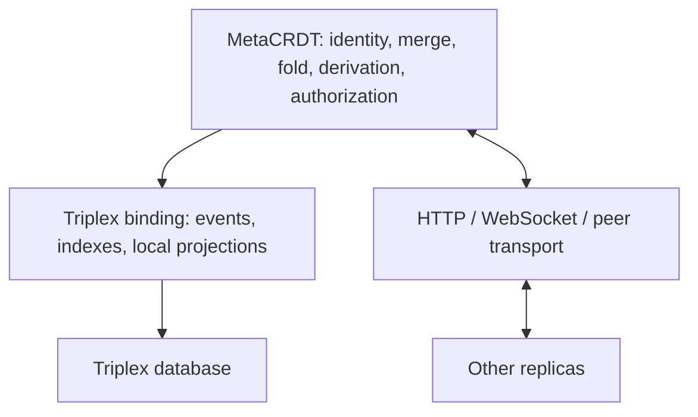

# Full MetaCRDT protocol on Triplex

## Status and next action

**Status:** working plan; full protocol binding is not implemented.
**Scope:** MetaCRDT L1–L5, including all coordination profiles described in §9.
**Created:** 2026-09-15.

The current [`@metacrdt/triplex`](../../packages/triplex/README.md) package proves
one host-owned coordination loop. It does not implement the replicated event
protocol. The existing core, runtime, local, Node, and Cloudflare packages contain
protocol and sync implementations to reuse and harden.

**Next actionable slice:** reproduce the missing-sequence counterexample in D01,
choose a coverage model, and update the anti-entropy draft and executable tests.
Do this before building a new sync binding around the current maximum-sequence
version vector.

This plan records the direction and unresolved choices. It does not silently
amend the normative [protocol](../reference/protocol.md), declare existing code
fully conformant, or require all proposed Triplex extensions before work starts.

## How to use this document

- Work through one decision or implementation slice at a time.
- Record decisions in the register with rationale and links to the resulting
  spec changes, implementation, tests, or PRs.
- Mark a checkbox complete only when its acceptance criteria have evidence.
- Keep the next action above current and add a short entry to the progress log.
- Label proposed upstream APIs as proposals until they exist in a tested Triplex
  version; distinguish sibling-checkout capabilities from published ones.
- Do not replace the existing runtime or claim full parity until the applicable
  conformance gates pass.

## 1. First principles

A replica's authoritative state is a set of verified immutable events, `L`.

```text
merge(L1, L2) = L1 ∪ L2
state        = fold(L, coordinate)
derived      = evaluate(definitions visible in L, state, coordinate)
replication  = deliver missing authorized events
```

Equal event sets, coordinates, and evaluator semantics must produce equal state
and derived values. Arrival order, local database IDs, polling history, wall-clock
reads inside a fold, and materialization order must not affect that result.

Here, **Triplex as transport** means a durable event carrier and indexed storage
binding. Network delivery remains an explicit HTTP, WebSocket, or peer-channel
binding. Triplex's native transaction semantics do not define MetaCRDT merge or
visibility semantics.



### Three categories of state

| Category | Examples | Replication rule |
| --- | --- | --- |
| Canonical events | Assertions, lifecycle events, authored definitions, grants, signed decisions | Replicate according to authorization and protocol rules. |
| Derived facts | Obligations, membership, approvals, computed views | Recompute; §6 forbids merging them as replicated source facts. |
| Local bookkeeping | Ingestion positions, materialization runs, checkpoints, caches, worker scheduling metadata | Keep local and reconstruct or recover independently. |

Durable workflow decisions need explicit classification: an authored execution
decision can be a canonical event; an automatically computed candidate is a
derived fact. Persistence alone does not make either one replicated truth.

### Separate time and identity domains

- Keep the original `EventId`, actor, authoring HLC, valid interval, and causal
  references intact on receipt.
- Record local ingestion time and Triplex commit position separately.
- A node receiving an event at time 500 that was authored at time 100 must not
  rewrite its authoring timestamp to 500.
- Keep MetaCRDT's canonical encoding separate from Triplex's canonical JSON and
  content-ID format.
- Triplex triple IDs and transaction IDs are local handles. Protocol explanations
  resolve to canonical `sourceEventIds`.

## 2. Responsibility and Triplex gap register

The correctness baseline should use existing public Triplex APIs where possible.
The extensions below improve ergonomics, efficiency, or portable guarantees; they
are not all prerequisites for a first implementation.

| ID | Capability | Existing foundation | Proposed addition / fallback | Owner and priority |
| --- | --- | --- | --- | --- |
| T01 | Immutable keyed event bodies | Atomic fact batches, application-selected entity IDs, unique command receipts | A keyed immutable-object API with explicit existing/conflicting-content results; initially implement with application facts and receipts. | Triplex primitive candidate; early binding work. |
| T02 | Atomic replica bookkeeping | Conditional writes and batched operations | A documented cross-backend contract for event append plus HLC/sequence/receipt updates; use conditional retries rather than separate commits. | MetaCRDT binding first; upstream only for demonstrated gaps. |
| T03 | Efficient anti-entropy reads | Datalog, indexes, local ordered journal | Bounded indexed origin/sequence-range scans, missing-ID lookup, and stable continuation; initially index event descriptors as facts. | Generic Triplex indexing/query improvements after D01/D02. |
| T04 | Shared read snapshot | Snapshot-stable query pagination | A public database-scoped snapshot handle shared by match/entity/history/schema/query operations; initially load one stable event set for the pure fold. | High-value Triplex extension; required before optimized multi-read folding. |
| T05 | Querying protocol-visible state | Native Triplex temporal queries and Datalog | A supported derived-relation/query-input boundary or efficient local projection maintenance; initially use the pure MetaCRDT evaluator. | MetaCRDT owns semantics; Triplex owns reusable query mechanics. |
| T06 | Canonical source provenance | Triple and transaction provenance | Map local source rows to application event identities; broader aggregate/recursive provenance only where needed and precisely defined. | Binding first; reusable Triplex provenance hooks are optional. |
| T07 | Lossless payloads and large content | String/JSON facts and blob metadata | Preserve canonical bytes with explicit encoding; optional byte/blob service for streaming larger payloads. | Correctness possible now; storage optimization later. |

### Event storage shape to validate

This is a proposed logical layout, not a committed public API:

```text
immutable canonical body:
  eventId -> canonical body bytes

verified envelope / receipt metadata:
  eventId, origin replica, origin sequence, signatures/attestations

indexes:
  entity + attribute
  targetEventId
  origin replica + sequence
  authoring HLC
  local ingestion position
```

The canonical body is distinct from fields excluded from its hash, such as `seq`
and `sig`. D03 determines how conflicting envelopes are validated and stored.

Retractions and tombstones remain immutable protocol events. Do not delete their
target from the canonical store or require it to have arrived already. Indexes
and projections must be rebuildable from canonical events.

Raw event intake must not enforce application cardinality by discarding a losing
concurrent assertion. Event authenticity/admission and projected application
constraints are separate decisions.

### What stays in MetaCRDT

Canonical encoding, hash verification, HLC ordering, event merge, visibility,
schema-at-coordinate resolution, anti-entropy, signatures, actor-key policy,
capability redemption, membership, quorum, authorized projections, and protocol
versioning remain MetaCRDT responsibilities. Triplex supplies storage guarantees,
not these policy meanings.

## 3. Protocol decision register

All entries below are **open**. A recommendation is not an accepted protocol change.

### D01 — Sequence coverage and missing events

**Problem:** §8 and `runtime/src/sync.ts` summarize the maximum observed sequence.
If B receives A:12 but misses A:11, advertising A:12 suppresses retransmission of
A:11. Set-union merge alone does not repair an incomplete delivery protocol.

**Decide:** contiguous frontiers plus gaps, acknowledged ranges, or another set
reconciliation model. Strictly increasing sequence numbers are not necessarily
contiguous: also specify allocation gaps after crashes and replica re-creation.

- [ ] Add a failing counterexample for receiving 12 before 11.
- [ ] Define coverage and recovery for dropped batches, allocation gaps, and restarts.
- [ ] Update protocol §8, runtime tests, and the [TLA+ plan](./anti-entropy-tla.md).
- [ ] State liveness assumptions explicitly: reconnection and eventual delivery
  cannot coexist with an adversary dropping every retry forever.

### D02 — Authorized partial replication and incomplete knowledge

**Problem:** authorization deliberately withholds events. One global sequence
maximum does not describe what a reader is entitled to receive, and absence of a
hidden fact is not evidence that the fact is false.

**Decide:** authorized stream/scope identities, policy epochs, backfill on grant
changes, bootstrap access to policy facts, and query semantics for denied or
incomplete inputs. Define the convergence claim for replicas with different access.

- [ ] Specify scope-bound coverage and permission-change resynchronization.
- [ ] Specify how negation, membership, and quorum handle incomplete evidence.
- [ ] Preserve hash verification without sending unauthorized canonical payloads;
  define `Denied` markers or proof objects separately from original events.
- [ ] Define revocation behavior without claiming already disclosed plaintext can
  be recalled from a peer.

### D03 — Sequence authenticity, identity, and signatures

**Problem:** the event hash excludes `seq`; a signature over `EventId` therefore
does not authenticate the replica/sequence binding used for sync progress.

**Decide:** trusted transport assumptions or authenticated sequence attestations;
handling of conflicting sequence claims, replica identity reuse, actor-key
rotation, and invalid or unknown signatures.

- [ ] Define and test origin + sequence + event-ID authentication.
- [ ] Define duplicate-body versus conflicting-envelope behavior.
- [ ] Specify validation before updating replication coverage or the durable clock.

### D04 — Bounded capabilities and execution ownership

**Problem:** two disconnected nodes can both redeem a capability's last use.
Both redemptions can merge, but merge cannot undo external actions already taken.

**Decide:** an authoritative redemption path, preallocated rights, another
coordination scheme, or explicitly eventual violation detection. Define distinct
signer counting and membership-at-signature-time for quorum approval.

- [ ] Choose guarantees for strict `maxUses` and partition behavior.
- [ ] Specify quorum proof inputs, expiry, revocation, and historical membership.
- [ ] Define execution ownership and idempotency separately from derived approval.
- [ ] Test competing redemptions and approvals across independent databases.

### D05 — Historical knowledge and visibility boundaries

**Problem:** the draft uses authoring HLC physical time for transaction-time
visibility but also describes queries as "what was known then". A late event
changes an authoring-time view without changing what a particular replica had
actually received at that earlier instant.

**Decide:** distinguish protocol coordinates from local ingestion snapshots;
define how callers request each. Review lifecycle visibility at equal physical
milliseconds, where the HLC logical component orders events but the current
tombstone predicate compares physical time only.

- [ ] Specify authoring-time versus replica-knowledge history.
- [ ] Add late-arrival, historical schema, and same-millisecond lifecycle vectors.
- [ ] Define temporal wakeups and invalidation for late changes, including negation.

### D06 — Canonical encoding, numeric range, and wire version

**Problem:** the draft's canonical-value requirements, the current tagged-JSON
core encoding, and Triplex canonical JSON are different contracts. JavaScript
numbers also do not represent the full specified `u64` range exactly.

**Decide:** the exact normative encoding and supported number domains, Unicode
normalization/key ordering, identifier format, signature encoding, and migration
strategy for existing event IDs. A change to hash or visibility semantics must
follow the protocol's major-version rules.

- [ ] Publish golden encoding/hash vectors, including bytes and numeric edge cases.
- [ ] Reconcile the spec with existing `e_`-prefixed IDs and wire envelopes.
- [ ] Reject malformed shapes and unsupported major versions at every boundary.
- [ ] Record compatibility rules before changing existing stored identities.

### D07 — Definition facts, compiled releases, and derived-state identity

**Problem:** the full protocol resolves definitions/cardinality from facts at a
coordinate. The current consumer instead pins a Triplex release and maintains
polling-dependent occurrence history.

**Decide:** a deterministic definition compiler whose Triplex releases are
artifacts of replicated definition events, with explicit evaluator versions.
Classify every current coordinator record as a derived value, local record, or
authored coordination decision.

- [ ] Preserve historical schema and rule resolution from the event set.
- [ ] Make derived identity/provenance independent of local Triplex IDs and positions.
- [ ] Keep derived facts, materializations, and checkpoints out of sync payloads.
- [ ] Define occurrence/execution history without relying on each node seeing
  identical intermediate states or polling at identical times.

### D08 — Effect boundaries and reference implementation discipline

**Problem:** the original repository discipline targets Effect 3 while the
published Triplex consumer uses Effect 4. Existing core algorithms are pure, but
service/layer values cannot be assumed compatible across those versions.

- [ ] Decide which pure algorithms to share and which runtime services to port.
- [ ] Update the repository-specific protocol discipline explicitly where needed.
- [ ] Use schema-validated boundaries, typed Effect failures, and effectful
  conformance tests as required by the agreed reference discipline.

## 4. Implementation phases and acceptance gates

### Phase 0 — Make conformance testable

- [ ] Resolve D01–D08 sufficiently to specify the promised L1–L5 behavior.
- [ ] Commit protocol amendments and encoding/visibility/sync vectors.
- [ ] Add model-checking configuration and record results or outstanding proof
  obligations; do not describe the current TLA+ scaffold as a completed proof.

**Exit:** each guarantee has precise assumptions, executable examples, and an
identified implementation owner. Later phases may begin independently when their
required decisions are settled.

### Phase 1 — Canonical event store on Triplex

- [ ] Implement schema-validated event intake and lossless body storage.
- [ ] Atomically persist local event creation with HLC/sequence advancement.
- [ ] Atomically persist received events and the chosen receipt/coverage metadata.
- [ ] Add origin/sequence, entity/attribute, and lifecycle-target indexes.
- [ ] Implement bounded export and pending-target/dependency handling.

**Exit:** duplicate delivery is idempotent, conflicting envelopes follow D03,
crashes do not reuse origin sequences, invalid events cannot advance progress,
and all indexes rebuild from canonical storage. Verify on KV and SQLite first.

### Phase 2 — L1/L2 state and historical reads

- [ ] Bind the pure fold to stable event snapshots.
- [ ] Preserve cardinality-at-coordinate and all four lifecycle operations.
- [ ] Add current projections as explicitly local caches.
- [ ] Compare query results and historical visibility with the agreed core oracle.

**Exit:** independent stores receiving the same events in different orders have
equal normalized results for every test coordinate and audit flag, including
late targets, concurrent assertions, schema changes, and tombstone cycles.

### Phase 3 — L3 derivation and provenance

- [ ] Evaluate deterministic rules over protocol-visible state.
- [ ] Return canonical `sourceEventIds` and resolve complete explanations.
- [ ] Specify supported recursion and aggregate semantics, including quorum proofs.
- [ ] Track negative dependencies, temporal boundaries, and projection freshness.
- [ ] Rebuild local materializations without changing derived identities/results.

**Exit:** equal inputs yield equal derived facts/provenance regardless of database
IDs, ingestion order, prior polling, or materialization history. Use the
[monotonicity plan](./datalog-monotonicity-classification.md) where applicable;
determinism does not establish that a partial input set is complete.

### Phase 4 — L4 multi-node synchronization

- [ ] Bind the agreed anti-entropy protocol to two independent persistent databases.
- [ ] Reuse/harden existing Node HTTP, browser, peer-channel, and Cloudflare
  transports progressively; do not duplicate their semantics per backend.
- [ ] Implement bounded batches, backpressure, retries, and restart recovery.
- [ ] Apply D02/D03 to scope changes and authenticated coverage.

**Exit:** partition both nodes, author on each, reconnect with dropped/duplicated/
reordered messages, and recover equal authorized event sets, folds, and derived
answers. Repeat across restarts and include the D01 missing-event regression.
Two workers sharing one database do not satisfy this gate.

### Phase 5 — L5 coordination and security profiles

- [ ] Implement capabilities, redemption records, and revocation/expiry semantics.
- [ ] Derive membership and quorum with historical proof inputs.
- [ ] Enforce write admission and attribute-level read/sync authorization.
- [ ] Implement the selected strict-use and execution-ownership guarantees.
- [ ] Define erasure/crypto-shredding boundaries without equating tombstones with deletion.

**Exit:** adversarial tests cover malformed signatures, replayed redemptions,
concurrent last-use attempts, duplicate signers, revocation, membership changes,
denied attributes, and filtered-history backfill. State limitations under network
partitions and compromised/disconnected peers explicitly.

### Phase 6 — Application parity and optimization

- [ ] Integrate the existing collection, workflow, Forma, ViewSpec, and client surfaces.
- [ ] Migrate current host-owned coordinator records according to D07.
- [ ] Extend backend conformance to PostgreSQL and the applicable browser/Cloudflare adapters.
- [ ] Rehearse an existing-data migration and compare current/historical reads.
- [ ] Measure event export, fold, derivation, and storage costs; propose T01–T07
  upstream work against demonstrated bottlenecks or missing guarantees.

**Exit:** publish a feature/backend conformance matrix with evidence; do not infer
application parity from passing the event-merge tests alone.

## 5. Non-goals and guardrails

- No automatic replacement of the existing Convex app, runtime, or event history.
- No redefinition of MetaCRDT truth using Triplex arrival order or local IDs.
- No replicated derived facts or automatic promotion of polling-dependent work
  records into canonical protocol events.
- No claim of exactly-once external effects or strict global usage limits from
  CRDT merge alone.
- No requirement that Triplex adopt domain-specific workflow, permission, or
  conflict-resolution semantics.
- No silent breaking change to event encoding, wire versions, or temporal semantics.

## 6. Evidence and related work

- [Normative draft](../reference/protocol.md): L1–L5, data model, fold, sync, profiles.
- [Current Triplex consumer](../reference/triplex-coordination.md): implemented
  host-owned slice; it remains a valid consumer while the full binding is built.
- [Core](../../packages/core/README.md): hashing, HLC, events, merge, and fold.
- [Runtime sync implementation](../../packages/runtime/src/sync.ts): current
  maximum-sequence version-vector algorithm; D01 addresses its coverage issue.
- [Local](../../packages/local/README.md), [Node](../../packages/node/README.md),
  [Cloudflare](../../packages/cloudflare/README.md): existing storage and transports.
- [Conformance testkit](../../packages/testkit/README.md): existing cross-target
  checks and their explicitly limited deployment coverage.
- [Anti-entropy model](./anti-entropy-tla.md) and
  [rule monotonicity](./datalog-monotonicity-classification.md): related work to
  reconcile with this plan rather than duplicate.

Triplex was inspected in the sibling `../triplex` checkout at `313542f` on
2026-09-15. The current consumer
pins npm snapshot `0.0.0-next-20260904185815` with Effect `4.0.0-rc.112`; sibling
source may contain newer APIs. Recheck upstream/public-package differences before
implementing a phase. Relevant upstream documents are `docs/current-state.md`,
`docs/operational-primitives.md`, and the public `Triples`/temporal contracts.

## 7. Progress log

| Date | Entry | Evidence / next action |
| --- | --- | --- |
| 2026-09-15 | Recorded full L1–L5 binding plan, Triplex gap register, protocol decisions, and acceptance gates. No full-binding phase is complete. | Next: D01 counterexample and coverage decision. |
