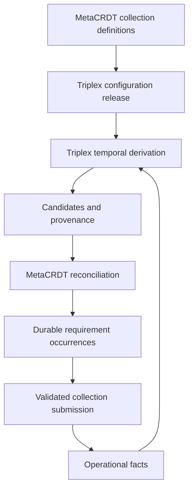

# MetaCRDT as a Triplex consumer

## Decision

MetaCRDT's new application architecture is a coordination runtime above Triplex.
It uses Triplex's public APIs and extends its configuration vocabulary through
ordinary typed nodes. The first slice is implemented in
[`@metacrdt/triplex`](../../packages/triplex/README.md).

The product thesis is: **versioned policies and facts determine explainable work;
human and agent participation supplies the facts that change that work.**

## Ownership

| Concern | Owner |
| --- | --- |
| Facts, temporal reads, transactions, causal journal | Triplex |
| Configuration nodes, releases, refs, graph constraints | Triplex |
| Datalog, provenance, materialization, temporal edge discovery | Triplex |
| Requirement occurrences and their lifecycle | MetaCRDT |
| Collection definitions and validated submission plans | MetaCRDT, reusing `@metacrdt/collect` |
| Journal consumption and durable application wakeup state | MetaCRDT, using Triplex checkpoints/facts |
| Authentication, authorization, tokens, timer delivery | Host application |
| Workflow execution, external effects, generated interfaces | Future MetaCRDT consumers |

The new package owns no triple store, query engine, snapshot implementation, or
parallel audit log. It uses no Triplex internal adapter API. Its npm snapshot is
pinned, so the sibling `../triplex` checkout is design reference rather than a
runtime dependency.

## Implemented contract

The executable SQLite example exercises publishing a typed collection release,
opening a requirement from a missing-evidence derivation, previewing a submission,
committing evidence, resolving work, and reopening a new occurrence at evidence
expiry after the database connection and host runtime have been closed/reopened.

Reconciliation applies the full desired candidate set to stored occurrences.
Materialization diffs alone are insufficient for recovery: a crash can leave a
materialization committed with no corresponding application work; reevaluation
then reports unchanged candidates. Comparing against durable work repairs both
missed openings and missed resolutions.

Requirements and wakeup state commit in one transaction, guarded by the observed
coordinator head. Initialization is fenced by a unique command receipt. Journal
checkpoints advance afterward. Replays are idempotent; competing workers retry
after a typed conflict. A host delivers timers and periodically polls to recover
missed notifications. There is no external effect execution in this transaction.

An occurrence is `open` or `resolved`. Resolution means its candidate is no longer
derived. A compliance application can distinguish satisfied evidence from a
withdrawn assignment by evaluating additional domain facts; the generic runtime
does not equate all disappearance with successful completion.

Tests cover the lifecycle, read-only preview, crash windows, lost acknowledgements,
competing workers, provenance revision, future-effective facts, release pinning,
irrelevant journal traffic, population bounds, and SQLite restart persistence.

## Changes to the original model

### Versioned configuration is distinct from operational facts

Collection definitions become immutable typed configuration nodes. A published
release is pinned by derivations, requirements, previews, and submission plans.
Moving `live` does not change how old work validates a submission. This initial
runtime refuses an implicit release switch for an existing consumer; work
migration requires a later explicit policy and command.

### Determinism and replication are separate contracts

Triplex transactions and commit positions do not implement MetaCRDT's original
HLC event ordering, G-Set merge, or tombstone/untombstone protocol. The consumer
inherits Triplex's supported query and transaction semantics. Application work is
an eventually updated projection, with explicit source position and temporal
wakeup metadata. It makes no replica-convergence or exactly-once delivery claim.

The original protocol and tests remain useful for separately scoped replication
research. An eventual replication extension needs an explicit event/history
mapping and conformance proof; it cannot be obtained by swapping an EventStore.

## Package transition

| Existing package family | Direction |
| --- | --- |
| `collect` | Pure form validation is reused now; storage lowering is supplied by the new consumer. |
| `workflow`, `views`, `views-react`, Forma | Retain semantics; add consumers of Triplex configuration and query results in subsequent slices. |
| `runtime` | Existing Effect 3 convergence harness remains; new coordination currently lives in the Effect 4 Triplex package. |
| `schema`, `query`, persistence targets | Existing applications retain them; new Triplex-backed features use Triplex's implementations. |
| `core`, sync transports | Preserve the original protocol implementation and research tests. |

No existing Convex data or application paths are migrated by this change.

## Next slices

1. Bind ViewSpec/dashboard queries to the authorized Triplex consumer and expose
   requirement provenance and stale-state indicators in the existing UI.
2. Add workflow lifecycle and durable effect intents, then host outbox delivery,
   retries, and timer workers. Define action idempotency independently of derivation.
3. Define explicit release migration: retained occurrences, changed policies,
   withdrawn work, and validation of in-flight submissions.
4. Rehearse the old event-history to Triplex mapping, including retractions,
   tombstones, value encoding, and historical coordinates. Compare current and
   historical reads before moving any existing application.
5. Align Effect/Forma interfaces where shared runtime values are necessary.
   The first slice crosses only the pure collection-data boundary.

See the [package README](../../packages/triplex/README.md) for APIs, operational
limits, and the exact release dependency.
